# Scrambler

Scrambler is a cryptography-focused Android keyboard built on top of Simple Keyboard.

## About

Features:
- Hybrid Encryption
- Decryption
- Signing
- Verifying
- Handshake (offering and accepting)
- Sensitivity classification using a fine-tuned DistilBERT model
- QR code generation for keys
- QR code scanning for importing keys

Feature it doesn't have:
- Emojis
- GIFs
- Spell checker
- Swipe typing

## Running the App

1. Download Android Studio from https://developer.android.com/studio/releases.
2. Open the project folder in Android Studio. You can access the tool bar (by clicking the hamburger icon in the top left corner) at the top of Android Studio to run the app. The run button looks like a green triangle. If you hover over it, it should say "Run 'app'". If it says "Run 'Scrambler'" instead, click on the dropdown next to the run button and select "app" from the dropdown menu.
3. The tool bar at the top should show "app" in the dropdown next to the run button. If it doesn't, follow the next steps:
4. Sync gradle files by clicking the Elephant icon in the top right toolbar (or go to File > Sync Project with Gradle Files).
   - Wait: Look at the bottom status bar. If it says "Indexing" or "Gradle Build Running," wait for it to finish. Once done, "app" should automatically appear in the dropdown at the top next to the run button (which should become green)
5. If syncing the gradle files does not work: i.e. you see a "add configuration" in the dropdown next to a greyed out run button then you need to:
   - Go to Run > Edit Configurations > click the "+" icon > select "Android App" > select the "app" or "Scrambler.app" module in the module dropdown and add a name for the configuration like "app"> click "OK". Now you should see "app" in the dropdown next to the run button and the run button should be green. If you still see "add configuration" in the dropdown, try restarting Android Studio and it should work.
6. Create a device emulator in Android Studio by following https://developer.android.com/studio/run/managing-avds.
7. Choose a hardware profile from the Phone category.
8. Select any system image with API 26 or above, such as API 35+, API 36+, or newer.
9. Build and run the app from Android Studio after the emulator is ready.
10. Open extended controls for the emulator and set the cellular network to 5G. For additional guidance, see https://developer.android.com/studio/run/emulator-extended-controls.
11. Enable notifications for the Scrambler app in the device/emulator settings to see sensitivity classification results in toast notifications.
12. To test use case flows use a third party app that allows text input such as Briar messenger. You can download Briar messenger from the Play Store on the emulator or download the APK from https://briarproject.org/installing-apps-via-direct-download/ and install it on the emulator. Briar messenger is a secure messaging app that allows you to test all the features of the Scrambler keyboard such as encryption, decryption, signing, verifying, handshake, and sensitivity classification. You can also use any other app that allows text input to test the Scrambler keyboard, but Briar messenger is recommended because it does not require any account creation or phone number verification to use the app, which makes it easier to test the Scrambler keyboard features. Make sure to install Briar messenger on two or more emulators if you want to test the handshake and message encryption features between devices.
13. To test the QR code scanning feature on the device emulator, you can screen shot the QR code image from one emulator and upload the screenshot to the other emulator via the camera option in the extended controls of the emulator. For more details, see https://developers.google.com/ar/develop/java/emulator#add_augmented_images_to_the_scene.
 - The actualy image will appear inside a virtual apartment and you can scan the QR code by moving your avatar around the virtual apartment until the QR code is detected and scanned by the app. The QR code will be on the wall or table in the room in the kitchen behind the dog. See this webpage for how instructions on how to move around the virtual room: https://developers.google.com/ar/develop/java/emulator#control_the_virtual_scene.
14. To actually see the Scrambler keyboard, first you need to enable it in the device/emulator settings and set it as the default keyboard. Clicking the "OPEN SETTINGS" button in the app, for the first time if Scrambler is not enabled, will take you to the input method settings where you can enable the Scrambler keyboard and set it as the default keyboard. 
15. If using a device emulator and the Scrambler keyboard is not visible, ensure it is enabled and set as the default keyboard in the device/emulator settings. Then go to the "OPEN SETTINGS" screen in the app -> click "Preferences" -> Toggle "show on-screen keyboard" to on. This will make the Scrambler keyboard appear on the screen when you click on a text input field in any app.
16. Optional, if the key presses popping up on the text input field is distracting, you can disable it by going to the "OPEN SETTINGS" screen in the app -> click "Key press" -> Toggle "Popup on keypress" to off. This will prevent the key presses from appearing on the text input field when you type using the Scrambler keyboard.
17. To run on a physical Android device, you need to enable developer options and USB debugging on your Android device. Then connect your Android device to your computer via USB and select your device from the run configuration dropdown in Android Studio before clicking the run button. For more details, see https://developer.android.com/studio/debug/dev-options.
18. If you still encounter any issues with running the app, try cleaning and rebuilding the project in Android Studio by going to Build > Clean Project and then Build > Rebuild Project. 
19. If you encounter any issues with running the app on the emulator, try wiping the data of the emulator and restarting it. You can do this by going to AVD Manager > click the dropdown arrow next to your emulator > select "Wipe Data" > confirm by clicking "Yes" > start the emulator again. You can also try creating a new emulator if wiping data does not work. Try cold booting the emulator if you encounter any issues. You can do this by going to AVD Manager > click the dropdown arrow next to your emulator > select "Cold Boot Now".

## Running SensitivityClassification.ipynb

I recommend running the notebook in Google Colaboratory at https://developers.google.com/colab.

Before running the notebook, upload these files to Colab:
- Fn_dataset.jsonl
- sensitive_data_password.csv
- synthetic_dataset.csv

If you want to deploy the model on Android devices, use TensorFlow 2.16.1 and transformers 4.40.0.

## Use Cases

### 1. Choosing a contact

**Instructions**

- To choose a contact for encryption, decryption, signing, or verifying, follow these steps:
  1. Open the Scrambler keyboard in any app that allows text input.
  2. Hold down the "," comma key to open the cryptographic operations keyboard.
  3. Press the "choose contact" key to open the contact selection dropdown.

#### Opening the keyboard:  
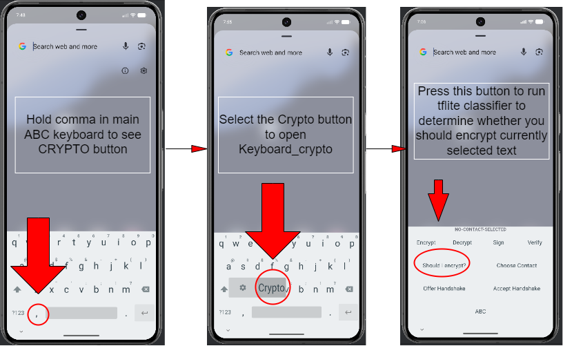
 
#### Selecting a contact:    
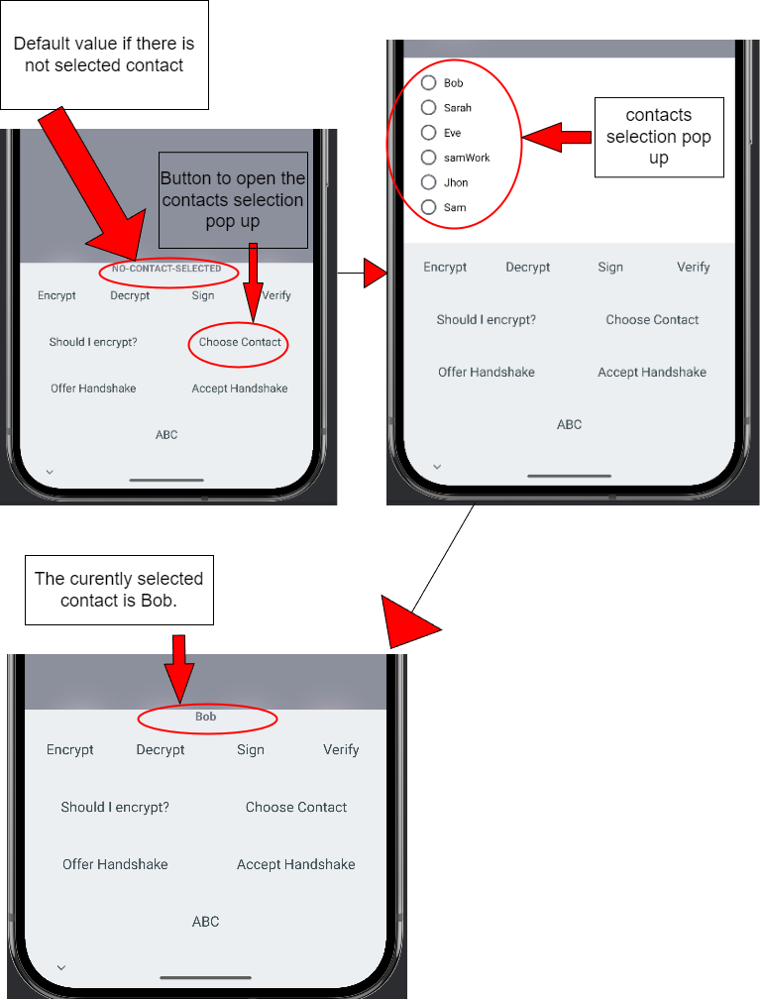

### 2. Encrypting a message

**Instructions**

- To encrypt a message, follow these steps:
  1. Open the Scrambler keyboard in any app that allows text input.
  2. Hold down the "," comma key to open the cryptographic operations keyboard.
  3. Press the "encrypt" key to encrypt the last 1024 characters of the text input field using the selected contact's public key.
  4. OR select a portion of the text input field and press the "encrypt" key to encrypt the selected text using the selected contact's public key.

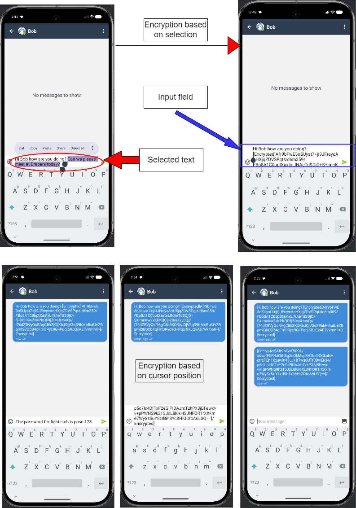

### 3. Decrypting a message

**Instructions**

- To decrypt a message, follow these steps:
  1. Open the Scrambler keyboard in any app that allows text input.
  2. Hold down the "," comma key to open the cryptographic operations keyboard.
  3. Select a portion of the text and copy it to the clipboard.
  4. Press the "decrypt" key to decrypt the copied text using your private key and the decrypted message will be displayed in a popup.

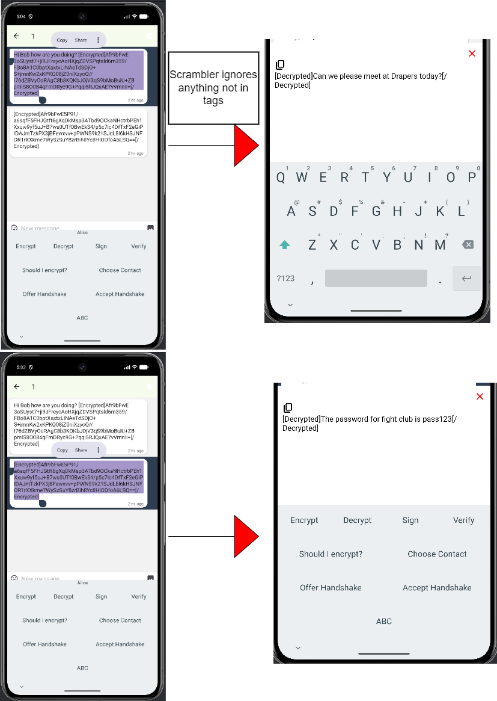

### 4. Signing a message

**Instructions**

- To sign a message, follow these steps:
  1. Open the Scrambler keyboard in any app that allows text input.
  2. Hold down the "," comma key to open the cryptographic operations keyboard.
  3. Press the "sign" key to sign the last 1024 characters of the text input field using your private key.
  4. OR select a portion of the text input field and press the "sign" key to sign the selected text using your private signing key.

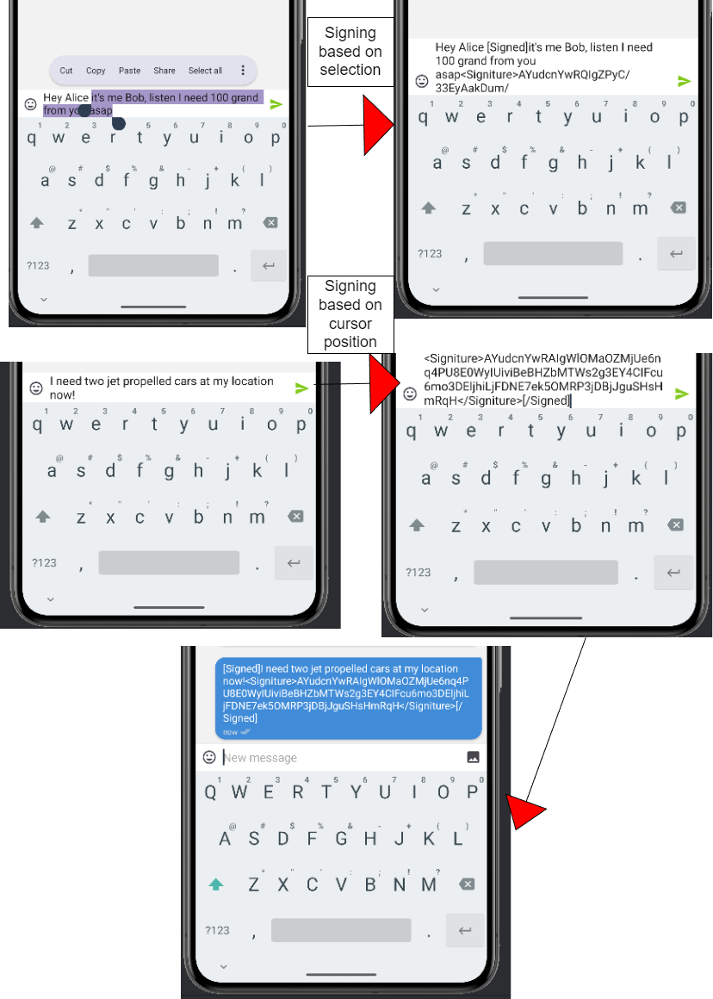

### 5. Verifying a signed message

**Instructions**

- To verify a signed message, follow these steps:
  1. Open the Scrambler keyboard in any app that allows text input.
  2. Hold down the "," comma key to open the cryptographic operations keyboard.
  3. Select a portion of the text and copy it to the clipboard.
  4. Press the "verify" key to verify the signature of the copied text using the sender's public key and the verification result will be displayed in a popup.

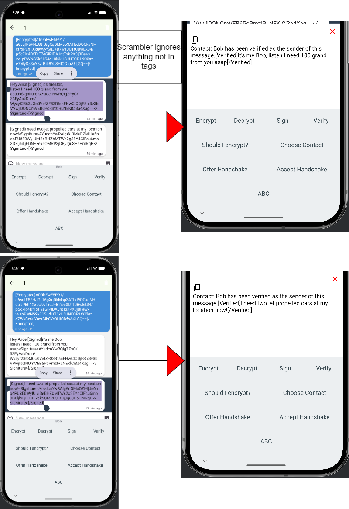

### 6. Offering a handshake

**Instructions**

- To offer a handshake, follow these steps:
  1. Open the Scrambler keyboard in any app that allows text input.
  2. Hold down the "," comma key to open the cryptographic operations keyboard.
  3. Press the "offer handshake" key to paste a handshake payload message containing a public key into the text input field. The recipient can then copy this handshake payload message to accept the handshake and use your public key for future encryption.

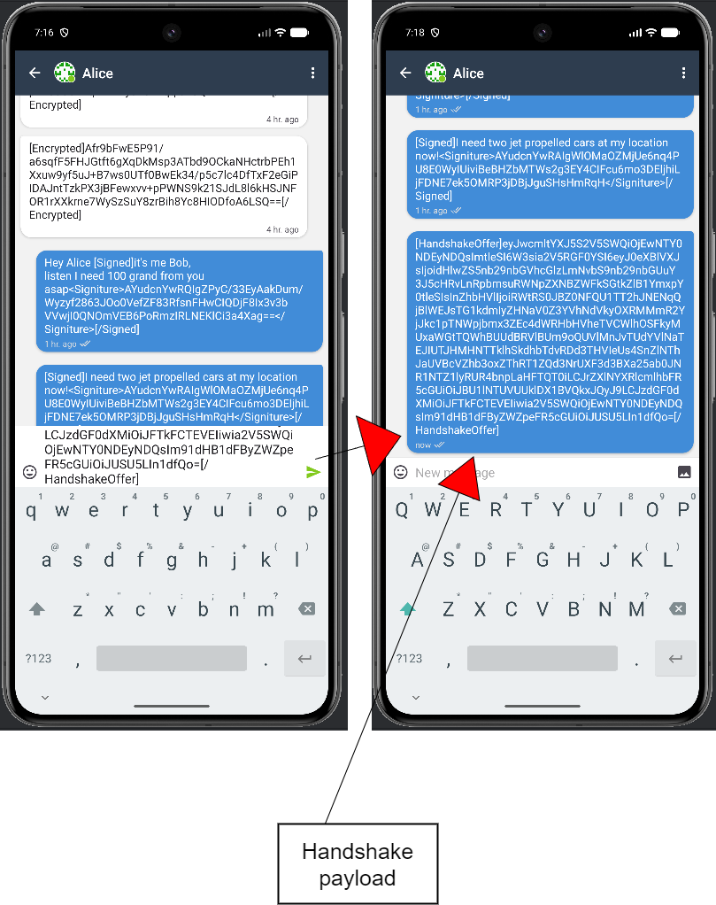

### 7. Accepting a handshake

**Instructions**

- To accept a handshake, follow these steps:
  1. Open the Scrambler keyboard in any app that allows text input.
  2. Hold down the "," comma key to open the cryptographic operations keyboard.
  3. Select the handshake payload message and copy it to the clipboard.
  4. Press the "accept handshake" key to accept the handshake and use the sender's public key for future encryption.

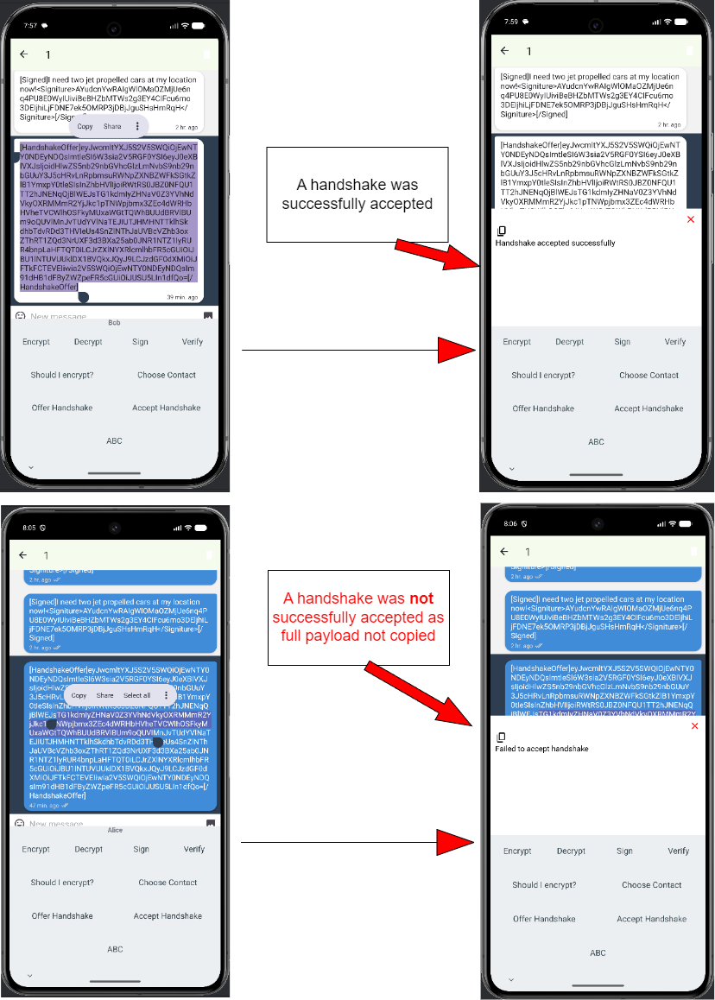

### 8. Classify message sensitivity

**Instructions**
- We don't store your data. Period. The sensitivity classification is performed locally on your device using a fine-tuned DistilBERT model, and the text you want to classify never leaves your device. 

- Enable notifications for the Scrambler app to see the sensitivity classification results in toast notifications.

- To classify the sensitivity of a message, follow these steps:
  1. Open the Scrambler keyboard in any app that allows text input.
  2. Hold down the "," comma key to open the cryptographic operations keyboard.
  3. Press the "Should I encrypt?" key to classify the sensitivity of the last 1024 characters of the text input field using a fine-tuned DistilBERT model.
  4. OR select a portion of the text input field and press the "classify sensitivity" key to classify the sensitivity of the selected text using a fine-tuned DistilBERT model. The sensitivity classification result will be outputted in a toast notification.

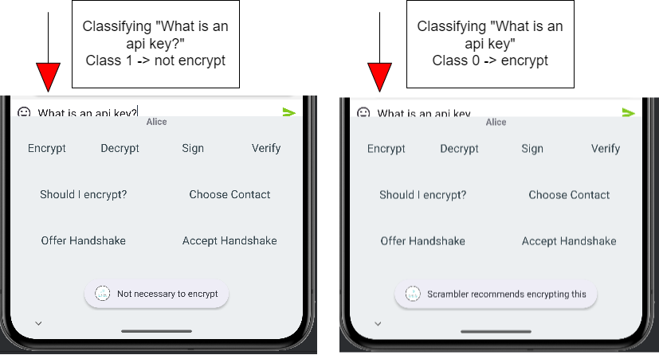

### 9. Viewing all contacts

**Instructions**

- Open the Scrambler main app to view all your contacts and their associated public keys. You can also manage your contacts by adding new ones, editing existing ones, or deleting existing ones from this screen.

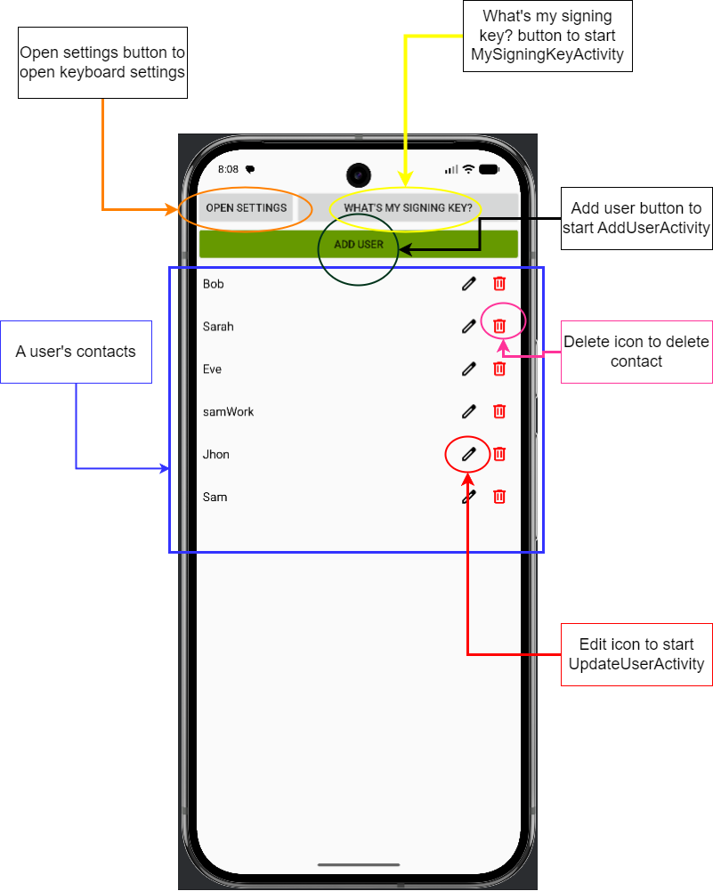

### 10. Adding a new contact

**Instructions**

- To add a new contact, follow these steps:
  1. Open the Scrambler main app to view all your contacts.
  2. Press the "add user" button to open the add contact screen.
  3. Enter the contact's name and public key and/or signing key in the respective fields and press the "save" button to save the new contact.
  4. Valid contact name consists of only letters a-z (case-insensitive) and digits 0-9.
  5. Pressing the "GENERATE NEW KEY PAIR" button will automatically generate a new public/private key pair for the contact and fill in the public key field with the generated public key. 

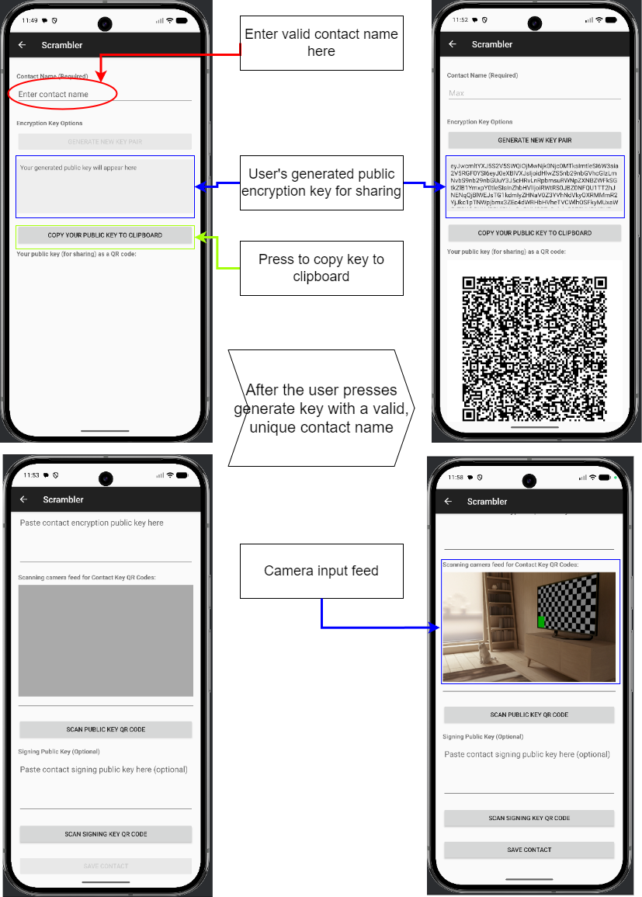

### 11. Editing an existing contact

**Instructions**

- To edit an existing contact, follow these steps:
  1. Open the Scrambler main app to view all your contacts.
  2. Select the contact you want to edit.
  3. Press the edit icon to open the edit contact screen.
  4. Modify the contact's public key and/or signing key in the respective fields and press the "save" button to save the changes.

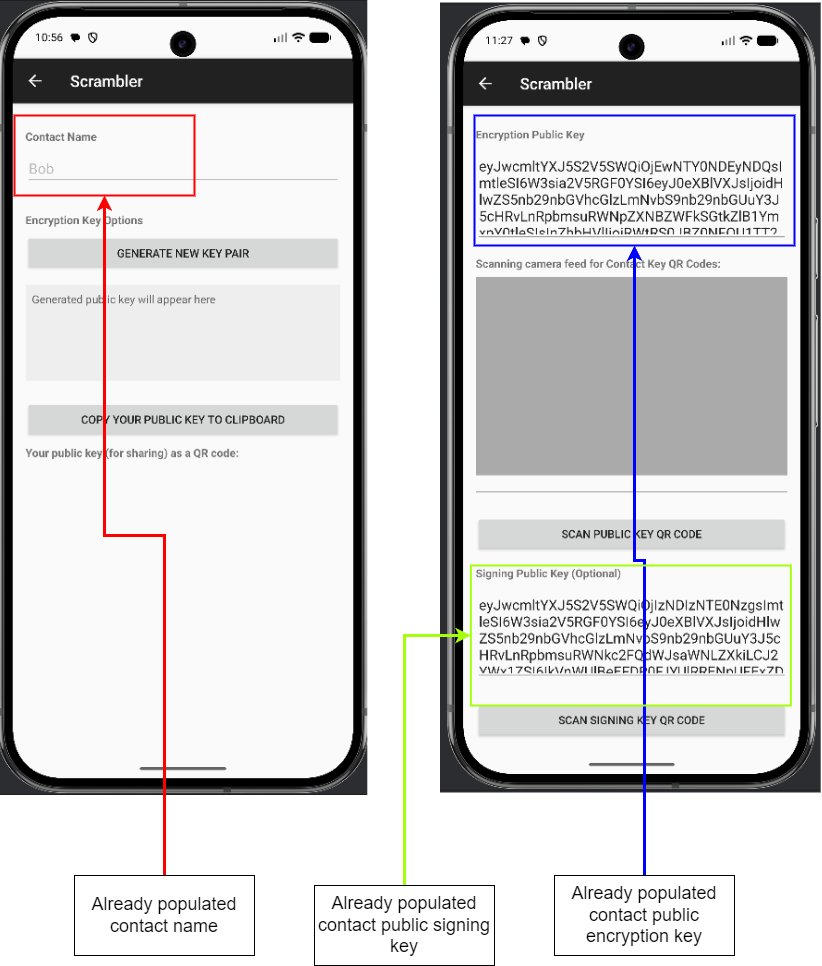

### 12. Viewing your own signing key

**Instructions**

- To view your own signing key, follow these steps:
  1. Open the Scrambler main app to view all your contacts.
  2. Press the "What's my signing key?" button to view your own signing key.

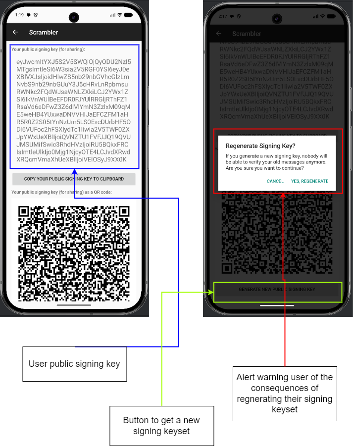

## Credits

This keyboard is based on the Simple Keyboard whose original source code you can find here: https://github.com/rkkr/simple-keyboard
